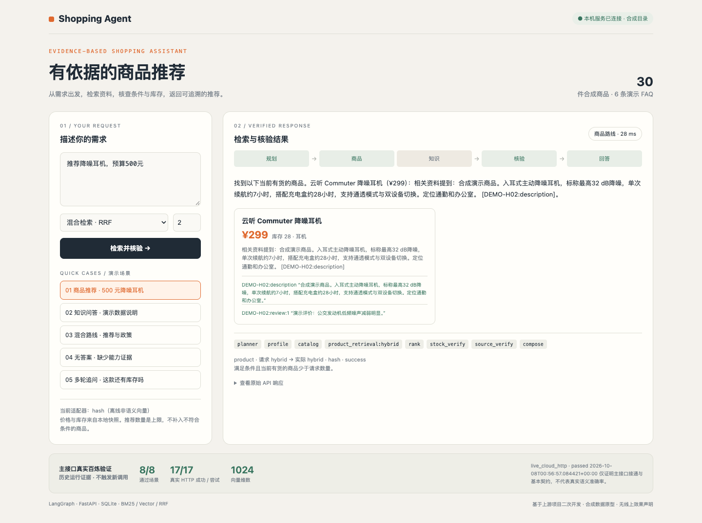
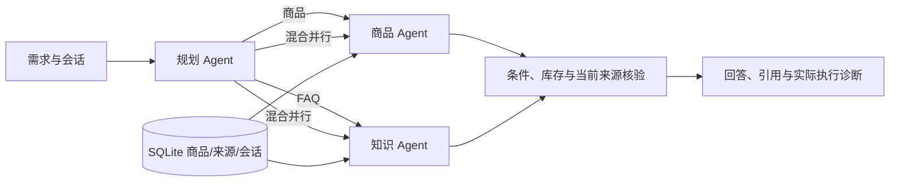

# Shopping Agent RAG · 多 Agent 电商导购

基于 [bcefghj/multi-agent-ecommerce-system](https://github.com/bcefghj/multi-agent-ecommerce-system) 二次开发的 Python 导购原型。把商品推荐、FAQ 和多轮追问接到可审计的检索与核验流程，面向 AI 应用 / Agent 开发岗位展示。

**Python 3.11 / 3.12 · FastAPI · LangGraph · SQLite · BM25 / Vector / RRF · 百炼 Embedding**



[约 49 秒演示视频](docs/demo/media/shopping-agent-demo.webm) · [启动与演示手册](docs/demo-guide.md) · [架构与代码导航](docs/shopping-architecture.md) · [简历与面试材料](docs/shopping-resume.md) · [当前验收状态](docs/release-status.md)

## 三分钟启动

需要 Python 3.11 或 3.12。在仓库根目录执行：

```bash
./scripts/setup_shopping_env.sh
./scripts/run_shopping_demo.sh --port 8000
```

浏览器访问 **http://127.0.0.1:8000/**。服务在独立内存数据库中导入 30 件合成商品和 6 条合成 FAQ，默认不调用云模型，不改已有数据库。重启会重置演示会话与数据；运行持久服务见 [Python 服务文档](python/SHOPPING_AGENT.md)。

只启动生产 API 的方式：

```bash
cd python
.venv/bin/python -m uvicorn shopping_agent.app:app --host 127.0.0.1 --port 8000
```

默认数据库为当前目录的 shopping_agent.db。API 文档：`/docs`；推荐接口：`POST /api/v1/shop/recommend`；健康检查：`GET /health`。

## 已实现的流程



- **检索**：BM25、余弦向量与 RRF 混合检索。默认 hash 向量是离线流程替身，不是语义模型；百炼 text-embedding-v4 为真实语义适配器。
- **事实核验**：价格与库存使用当前数据库行；规格与能力需要当前来源支持。推荐数量是上限，不凑数；缺证据、冲突或无合格商品时保守返回。
- **业务接入**：商品 / FAQ 共用百炼适配器；云向量索引延迟构建、同版本复用，来源更新后失效。故障回退 BM25，记录请求 / 实际模式与原因。
- **会话与实验**：多轮商品指代、稳定 A/B 分桶、曝光及点击/购买归因、离线回放。当前没有真实用户实验或 CTR/GMV 结论。
- **生成边界**：默认使用确定性回答模板；可选 LLM 只辅助选择已核验的商品，当前不属于自由文本生成质量评测。

## 2026-10-08 验证结果

| 验证范围 | 实际结果 | 证据与边界 |
|---|---|---|
| 完整 Python 测试 | **324 passed，0 skipped/xfail** | 仅沿用排除上游旧 numpy A/B 测试；新增 5 项发布工具测试与 2 项内存数据库并发回归 |
| 四套冻结质量门禁 | **PASS** | 原题 38/0、迁移 24/24、约束 18/18、证据 36/36；是合成同题回归 |
| 主 API 真实百炼调用 | **8/8 场景，17/17 HTTP 成功** | [真实 HTTP 报告](python/reports/business_cloud_smoke_20261008T005656Z.json)；1024 维、3,665 个 API 报告 Token，实际账单未知 |
| 主业务受控协议测试 | **43 场景、309 次 HTTP** | [故障与恢复报告](python/reports/business_embedding_integration_20261008T003757Z.json)；测试服务器向量不算语义成绩 |
| 32 题独立检索比较 | BM25 MRR@5 **0.8948**；百炼向量 **0.7902**；百炼混合 **0.9310** | 2026-10-07 统一合成语料，29 条有答案参与计分；不代表真实用户效果 |
| 可视化演示 | **5 次真实 API 交互，约 49 秒** | [录像及响应清单](docs/demo/media/recording-manifest.json)；录像使用离线 hash，底部单独展示历史云验证证据 |

真实主 API 验证包括商品向量、FAQ 向量/混合、混合路线、索引复用、BM25 零云调用和无答案处理；它证明接口接通与基本业务契约，不证明开放域语义准确率。云报告的源码指纹对应 5df155e；随后修复了内存 SQLite 会话并发共享连接问题，以离线回归和远端 CI 复验，未重复付费调用。

## 可选真实百炼

只从本机环境变量读取 `SHOPPING_EMBEDDING_API_KEY` 或 `DASHSCOPE_API_KEY`，不要把 Key 放入命令行、代码或 Git。确认允许发送相应文本后：

```bash
./scripts/run_shopping_demo.sh --provider bailian --allow-remote --port 8000
```

这会产生真实云请求及可能的费用。默认北京端点，Key 地域需匹配。独立复跑主 API 冒烟需指定一个全新输出路径：

```bash
PYTHONPATH=python python/.venv/bin/python -m shopping_agent.business_smoke   --provider bailian --allow-remote --max-http-calls 24   --output /tmp/my-new-business-smoke.json
```

输出已存在会在调用前拒绝覆盖；失败非零退出，不把降级当真实向量成功。旧检索 benchmark 的完整说明见 [Python 文档](python/SHOPPING_AGENT.md#独立-embedding-检索对比)。

## 复跑测试

仓库根目录：

```bash
PYTHONDONTWRITEBYTECODE=1 PYTHONPATH=python SHOPPING_LLM_API_KEY='' SHOPPING_LLM_MODEL=''   SHOPPING_EMBEDDING_API_KEY='' DASHSCOPE_API_KEY=''   python/.venv/bin/python -m pytest python/tests -q -p no:cacheprovider --ignore=python/tests/test_ab_test.py
```

四套评测及 quality_gate 命令以 [.github/workflows/shopping-agent.yml](.github/workflows/shopping-agent.yml) 为准；CI 无云密钥也能运行。

## 目录与二次开发范围

| 位置 | 内容 |
|---|---|
| `python/shopping_agent/` | 当前 Python 导购框架、存储、检索、核验、业务与评测入口 |
| `python/tests/`、`python/reports/` | 回归测试、冻结题集结果、真实/受控调用证据 |
| `docs/demo/`、`scripts/run_shopping_demo.sh` | 使用真实 API 的本机演示界面、截图与录像 |
| `docs/shopping-*.md`、`docs/demo-guide.md` | 当前架构、求职材料与操作手册 |
| `python/agents/`、`go/`、`java/` | 保留的上游教学实现，不纳入当前导购测试结论 |

[上游及此前 README 快照](docs/upstream-readme.md) 保留教学背景。早期 architecture、interview、resume-template 等文档已标为历史参考，当前求职表述以 [shopping-resume.md](docs/shopping-resume.md) 为准。

当前仅使用合成资料；没有真实商品授权、真人标注或线上流量。服务没有公开部署与用户鉴权，只绑定本机。当前快照未包含上游 LICENSE 文件，保留来源与历史，不另行宣称上游代码采用 MIT 许可。
