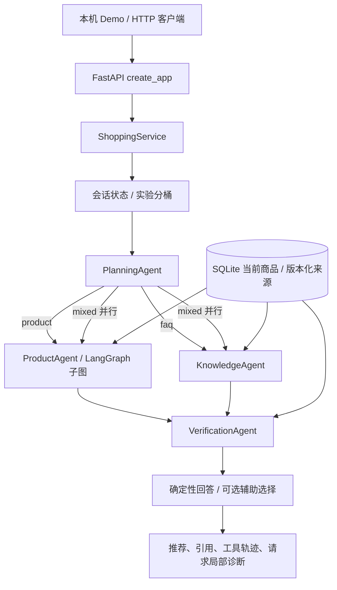

# 当前 Python 导购架构

适用于 python/shopping_agent；更新：2026-10-08。上游 Redis/Milvus/MySQL 与多语言教学图不代表本实现的运行依赖。

## 请求流

规划角色选择商品、FAQ 或混合路线；商品子图读取画像和候选、检索证据、排序与库存复核；知识角色检索 FAQ；核验角色检查当前来源与明确条件。角色拆分是可测试的职责和条件路由，默认没有四个自由对话的 LLM。

## 数据与检索边界

结构化数据库负责价格、库存、类别和行为归因；RAG 检索负责从描述、评价、FAQ 中找到支持材料。来源有 source_id、版本与更新时间；导入器记录来源/许可元数据。元数据存在不等于系统能够证明第三方资料的真实性或授权有效性。

EvidenceIndex 对资料分块、按来源去重，支持 BM25、精确余弦向量、RRF 排名融合。hash 是确定性离线替身；Ollama 保留本地适配；百炼复用 embeddings.py 的单一适配器，10 条分批、1024 维、严格返回索引/模型/向量校验。生产代码不导入评测标签或 benchmark。

百炼业务索引延迟到首次 vector/hybrid 请求创建，同版本复用，以锁防止并发重复构建；来源版本变化时重建。BM25、启动和健康检查不触发云请求。传输失败保留可核验 BM25 结果和真实降级原因，不切换 hash 冒充云语义模型。

## 推荐核验

- 解析已覆盖的价格、库存、类别、数值上下界、否定条件与受控能力。
- 每个商品分别判断 supported/refuted/unknown，附当前来源与原文片段；冲突与未知强能力条件保守排除。
- 返回前重查当前价格/库存及来源，防止旧快照或已删除资料继续支持推荐。
- num_items 是上限；来源 ID 匹配和原文摘录都不能直接证明全部自由文本语义正确。

## 执行诊断与并发

响应分别列 configured_embedding_provider/model、requested_retrieval_mode、effective_retrieval_modes、retrieval_diagnostics。请求局部 ContextVar 随 async/to_thread 传递，避免并发请求共享“最近一次结果”。工具等待超时后后台线程可能晚完成，响应复制已完成记录，不把晚返回的向量结果写成当时成功。

## 实验链路

稳定用户分桶，control 使用 BM25、treatment 使用 hybrid；曝光与点击/购买按请求和用户归因，记录降级和离线回放。只有实验设施，没有真实用户因果效果、CTR 或 GMV 提升。

## 代码导航

| 文件 | 现场可解释的重点 |
|---|---|
| app.py / schemas.py | 真实 API、输入校验与可观察响应契约 |
| workflow.py / agent_roles.py | LangGraph 条件路由、职责划分、并发和最终核验 |
| storage.py / conversation.py | SQLite、来源版本、会话持久化 |
| retrieval.py / embeddings.py | BM25 / Vector / RRF、共享适配器、延迟索引与失败边界 |
| constraints.py / product_requirements.py | 有限条件解析、证据支持及未知处理 |
| experiments.py | 分桶、请求归因、回放；没有线上效果声明 |
| evaluation*.py / catalog_evaluation.py / grounding_evaluation.py | 检索、完整商品集合、跨目录和引用核验的不同口径 |
| quality_gate.py / .github/workflows/shopping-agent.yml | 冻结输入与回归门禁，不能代替未见数据评测 |
| business_smoke.py / demo.py | 真实主 API 冒烟与本机展示壳；不改生产排序 |

## 当前验证与缺口

当前结果统一见 [release-status.md](release-status.md)。仍缺授权真实商品、真人标注、开放表达评测和真实用户流量；默认回答也不是自由文本 LLM 质量验证。没有公开部署、鉴权、生产监控或真实库存同步。当前状态是有真实 embedding 接入证据的可演示原型。
