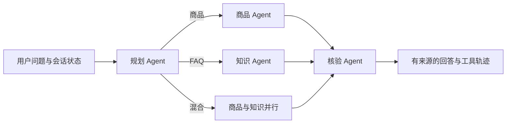

# Python 电商导购 Agent 框架

这是原项目之外的一条**可运行、可评测的 Python 改造链路**。它演示商品与 FAQ 来源管理、三路检索、有条件的 Agent 路由、多轮状态、库存复核和 A/B 实验链路。内置 30 件商品、6 条 FAQ、38 条原有评测问题和 32 条独立检索标注均为**合成演示数据**，不能据此宣称线上 CTR、GMV 或生产性能。本地演示接口没有用户认证，请只在本机使用；对外部署前需实现身份校验和访问控制。

## 工作流



编排使用 LangGraph 的条件路由，规划、商品、知识与核验角色有独立输入输出契约。商品、FAQ、用户行为与会话状态落在 SQLite。商品描述、评价、FAQ 均有版本化 `source_id`；检索可选 BM25、精确余弦向量、RRF 混合。无模型密钥时使用确定性模板；配置兼容接口的模型后，模型只能选择已核验商品与证据，文字仍由代码生成，失败时回退模板。数据库始终负责价格和库存，资料内容不能覆盖数据库事实。

这条链路仍是**导购工作流原型**：显式标签、数值和少数能力条件会被硬筛选，未知的强能力要求会拒答。对已覆盖的明确属性，系统会逐商品检查合取条件，并在返回前核对当前商品描述来源；`num_items` 是上限，不能靠补入不符合条件的商品凑数。明确的“无某能力”要求须有当前资料中的否定依据；单次续航与充电盒合计续航分别核验；商品描述、标签和评价对受控能力有直接矛盾时排除该商品并提示不确定。开放式自然语言和其他能力冲突仍需更完整的结构化属性与人工标注，不能仅凭词面检索证明所有条件。A/B 只具备接流量和离线回放的实验链路；当前没有真实流量、线上提升结论或生产库存服务。

请求中的 `category` 可显式指定类目，适合包含多个商品名称的复杂问句；未指定时才从问题文本做简易识别。`num_items` 接受 1–10，但满足类目、价格、属性与库存条件的商品不足时会返回更少，并在 `warnings` 中说明。

## 模块边界与 RAG 位置

| 环节 | 当前实现 | 后续扩展接口 |
|---|---|---|
| 用户偏好 | SQLite 行为计数；多轮状态按用户和会话持久化 | 接获授权用户行为 |
| 候选召回 | 数据库类目、预算、库存、部分显式条件硬筛选 | 扩充经核验的结构化属性 |
| 资料检索 | BM25、向量、混合检索商品与 FAQ；按来源 ID 去重 | 对比真实 embedding 与人工相关性 |
| 排序 | 来源分数、类目偏好和价格 | 在获授权数据上训练排序 |
| 库存与回答 | 最终重新读取商品与当前来源版本，再生成回答 | 接权威实时库存服务 |

默认路径是**检索增强的确定性回答**。价格和库存以数据库为准。来源更新或删除后，旧 ID 不再可引用；运行中的服务会检测修订并重建内存索引。检索命中只表示相关，不能自动证明每一项用户主张；独立标注集按预先指定的支持来源另行评测。当前合成题与标签由代理编写并复核，尚未获得真人标注。

## 目录

| 文件 | 作用 |
|---|---|
| `shopping_agent/storage.py` | 商品、FAQ、来源版本、库存与行为 SQLite 存储 |
| `shopping_agent/retrieval.py` | 分块、BM25、向量和混合检索 |
| `shopping_agent/product_requirements.py` | 明确商品属性的查询识别与当前来源支持检查 |
| `shopping_agent/constraints.py` | 有类型的硬条件解析、支持/反驳/未知判断及当前来源 ID 复核 |
| `shopping_agent/agent_roles.py` | 规划、知识与核验角色契约 |
| `shopping_agent/workflow.py` | 条件路由、商品 Agent、排序和库存复核 |
| `shopping_agent/conversation.py` | 多轮会话持久化 |
| `shopping_agent/experiments.py` | A/B 分桶、归因与离线回放 |
| `shopping_agent/answer.py` | 有据模板及可选模型回答 |
| `shopping_agent/app.py` | FastAPI 接口 |
| `shopping_agent/catalog_cli.py` | 商品与 FAQ JSONL 导入/删除/原文查询 |
| `shopping_agent/evaluation.py` | 原评测与独立标注检索对比 |
| `shopping_agent/evaluation_multi.py` | 完整合格商品集合的离线评测，分别统计精确率、召回、引用与拒答 |
| `shopping_agent/catalog_evaluation.py` | 在独立内存数据库导入另一份目录，再按完整集合标签评测 |
| `shopping_agent/data/` | 明确标记为合成的商品、FAQ、问题和标注 |

## 本地运行

在 `python/` 目录执行，Python 3.11 或 3.12：

```bash
python3.11 -m venv .venv
source .venv/bin/activate
pip install -r requirements-shopping-dev.txt
uvicorn shopping_agent.app:app --reload
```

打开 <http://127.0.0.1:8000/docs> 查看接口。首次启动时自动建立本地 SQLite 数据库并导入 30 件合成商品、6 条合成 FAQ。数据库文件已被仓库的 `.gitignore` 忽略。

```bash
curl -X POST http://127.0.0.1:8000/api/v1/shop/recommend \
  -H 'Content-Type: application/json' \
  -d '{"user_id":"demo-user","query":"地铁通勤的降噪耳机，预算500元","num_items":3}'

curl -X POST http://127.0.0.1:8000/api/v1/events \
  -H 'Content-Type: application/json' \
  -d '{"user_id":"demo-user","product_id":"DEMO-H02","event_type":"click"}'
```

也可在仓库根目录运行：

```bash
docker compose -f docker-compose.shopping.yml up --build
```

设置 `SHOPPING_LLM_API_KEY`、`SHOPPING_LLM_MODEL`，按需设置 `SHOPPING_LLM_BASE_URL`，可开启模型辅助选择重点商品和证据。默认不访问外部模型。

请求可增加 `conversation_id` 持久化多轮上下文，以及 `retrieval_mode`（`bm25`、`vector`、`hybrid`）。响应保留原字段，并增加 `route`、`routing_reason`、`tool_trace`、`knowledge_evidence` 和实际检索模式。商品、FAQ、混合三类会执行不同工具轨迹；工具失败时返回可核验的降级答复。

默认向量基线使用确定性的 `hash-surrogate`，它**不是语义模型**，仅供离线验证索引与三路切换。若本机已运行 Ollama，并已安装本地 embedding 模型，可设置：

```bash
export SHOPPING_EMBEDDING_MODEL=nomic-embed-text
export SHOPPING_EMBEDDING_BASE_URL=http://127.0.0.1:11434
export SHOPPING_RETRIEVAL_MODE=hybrid
```

服务经 Ollama `/api/embed` 使用真实 embedding。当前实现只允许本机 Ollama 地址，避免无意上传商品或问题；未配置时无外部 API 费用。建索引会批量调用一次 embedding，向量/混合查询按请求调用；本地模型的计算成本与延迟取决于设备，评测只报告调用数与实测延迟，未测电费或硬件成本。端点失败时会回退 BM25 并在响应及实验日志中记录降级。

## 导入获授权资料

在 `python/` 目录执行：

```bash
export SHOPPING_SEED_DEMO=false
export SHOPPING_DATABASE_URL=sqlite:///./my_catalog.db
python -m shopping_agent.catalog_cli import-documents ./authorized_documents.jsonl
uvicorn shopping_agent.app:app --reload
```

命令默认写入 `./shopping_agent.db`，也可通过 `SHOPPING_DATABASE_URL` 或 `--database-url` 指定同一个服务数据库。**首次使用自有资料时请选一个新的数据库文件**；`SHOPPING_SEED_DEMO=false` 只阻止后续自动写入演示资料。JSONL 每行一个对象：

- 商品：`kind=product`、`product_id`、`name`、`category`、`price`、`stock`、`description`、`tags`、`reviews`。
- FAQ：`kind=faq`、`faq_id`、`question`、`answer`。
- 非合成资料两类均需 `source_url`、`license`、带时区的 ISO 8601 `updated_at`。这些字段应来自获授权原始资料；系统不会抓取或验证许可真伪。合成资料用 `data_origin=synthetic_demo` 明确标识，允许无 URL。

例如（字段值只用于展示格式，不代表已获真实授权）：

```json
{"kind":"faq","faq_id":"FAQ-001","question":"如何查询配送规则？","answer":"请以授权的配送政策原文为准。","source_url":"https://example.test/authorized-policy","license":"authorized-use","updated_at":"2026-09-23T10:00:00+08:00"}
```

价格最多两位小数，库存必须是非负整数。格式错误会使整批回滚。每个来源存储原 JSONL 行 `original_text`，可用 `python -m shopping_agent.catalog_cli source SOURCE_ID` 回溯；改动产生 `:v2` 等新 ID，旧 ID 立即失效。删除使用 `delete-product ID` 或 `delete-faq ID`。服务会检测数据库修订并自动重建索引，代码也可显式调用 `ShoppingService.refresh_index()`。`import` 是旧命令，仍可供原有本地测试使用；缺来源信息的商品会标为 `unspecified`，不会进入导购推荐。真实资料须使用 `import-documents`。

## 测试与评测

在 `python/` 目录执行：

```bash
python -m pytest tests -q --ignore=tests/test_ab_test.py
python -m shopping_agent.evaluation
```

旧 `test_ab_test.py` 属原项目链路，本环境缺少其 `numpy` 依赖；此命令仅排除该已知旧问题，不跳过新框架测试。评测入口保留原 38 问指标、32 条冻结的独立检索标注，以及完整合格商品集合评测。旧检索标注 SHA256 为 `ceae3893609a5ec2fec1f2340685f60732c6dbfe27caa92d464bd16d1bca3736`。每个商品题只有一个金标来源，不能从该组标签推断多商品推荐质量；其来源匹配也不能证明回答中的每句话均由资料支持。

完整集合评测的默认开发集有 25 题，使用 `--multi-labels` 可指定其他 JSONL。每题提供全部合格商品 ID、数量上限和逐商品当前资料 ID，程序比较 BM25、向量与混合三种**请求模式**，分别报告商品微观精确率、容量归一召回率、完整集合命中率、多商品题完整集合命中率、无答案结构性拒答率、正确商品的金标来源 ID 附带率和错误数。`num_items` 是返回上限；当合格商品多于上限时，完整集合命中指返回任意 `k` 件不同的合格商品。来源 ID 匹配只是较弱的证据代理，不能自动核验理由的语义；结构性拒答不核验回答正文。所有数据来自同一份 30 件商品的合成目录，离线 hash-surrogate 的结果不能代表真实 embedding、用户流量或线上效果。

首批留出集 24 题在开发集调优后的**首次运行**保存于 `reports/multi_product_holdout_first_run.json`：商品微观精确率 0.75、容量归一召回率 0.6857、完整集合命中 15/24、多商品题命中 7/12、无答案拒答 2/6，三种请求模式的商品结果相同。逐例诊断并修复价格与尺寸误解析、同义能力和库存问句路由后，同一题集调优后为 24/24；后者是开发反馈，不能算独立验证。引用 ID 附带率应和精确率、召回率一起看：首批留出集首次引用率也是 24/24，但仍有 8 件错误推荐和 4 条未拒答的无答案题。

第二组留出集在代码修复后独立编写并逐题复核，含 24 题、12 条多商品题、6 条无答案题及 2 条合格商品数大于请求上限的题；标签 SHA256 为 `fa755c4bbf8d739809a417a4c27291ed7c6217292d2ae6d607826ad8b40ea5f9`。**首次评分**见 `reports/multi_product_final_holdout_first_run.json`：三种请求模式的商品微观精确率均为 27/34（0.7941），容量归一召回率 27/30（0.9），完整集合命中 18/24，多商品题命中 8/12，无答案拒答 4/6，错误数 0。实际执行的商品检索模式与请求模式无不一致；5 题没有报告商品检索模式。逐例发现 IPX 等级、插口、折叠屏、佩戴方式同义词漏判，以及“不高于”“不能低于”数值方向错误；还发现数值条件商品可能只附评价来源。修复后同一组题达到 24/24、无答案 6/6，见 `reports/multi_product_final_holdout_tuned.json`。**该复测已使用这组题调参，不能代替首次独立成绩。**报告记录标签、目录和代码快照哈希；题集仍只覆盖同一份合成商品目录。

上一轮新框架测试基线为 152 passed；原 38 问为 0 errors，类目、库存、来源附带、预期有无及硬约束指标均为 1.0。实际简历可写清楚离线评测和误差修复过程，不能宣称调优集 100% 是未见问题准确率、真实用户效果或生产级 RAG 事实正确率。

### 跨目录迁移评测

`catalog_evaluation.py` 将指定 JSONL 导入全新的内存 SQLite，关闭演示数据自动导入，先检查金标商品和当前来源，再运行完整集合评测。报告记录输入目录文件、标签、实际来源快照与代码快照的 SHA256。运行时在 `python/` 目录执行：

```bash
python -m shopping_agent.catalog_evaluation \
  --catalog shopping_agent/data/transfer_products.jsonl \
  --labels shopping_agent/data/transfer_product_labels.jsonl
```

第二份目录包含重新编写的 30 件合成商品及 24 条代理编写、独立代理复核的完整集合标签；它检验旧目录规则能否迁移，仍不是真实用户或真人标注。首次报告保存在 `reports/transfer_catalog_first_run.json`，该文件不会被 CLI 覆盖。BM25 的完整集合命中为 **20/24**、商品精确率 **35/38**、容量归一召回率 **35/39**；向量与混合均为 **19/24**、**34/38**、**34/39**。三路无答案拒答均为 **4/6**、错误数 0。正确商品的描述来源 ID 附带率为 1.0，但该条件指标不覆盖错误商品，且 ID 匹配不验证全文语义。

首跑失败定位到无线连接与充电线词面混淆、VESA/eSIM/98 键漏核验、分辨率未硬筛，以及“库存大于零”误入混合路由。新增相应来源规则、精确分辨率筛选和路由回归后，同一目录复测三路均为完整集合 **24/24**、商品精确率 **39/39**、无答案拒答 **6/6**，见 `reports/transfer_catalog_tuned.json`。**这些题已用于修复，因此复测满分不能作为独立迁移准确率；首次成绩仍是独立证据。**

### 结构化硬条件与第三份合成目录

商品路线会解析明确的价格、库存、类目、数值上下界与单位（例如 kg 转 g）、精确存储/内存/像素/键数/IP 等级、否定的确切刷新率、来源明写的 2K/4K/8K 类别，以及 eSIM、NFC、主动降噪、独立数字区、佩戴方式等受控能力。每条条件返回 `field`、`operator`、`expected`、`unit`、`status`（`supported`、`refuted` 或 `unknown`）、当前来源 ID、摘录及冲突标记。价格、库存和类目取商品库当前行的内容哈希快照；规格和能力取当前版本商品描述、名称、标签或评价。数值规格优先取描述原文，标签中的粗略尺寸不冒充精确数值；2K 等类别仅按来源明写的类别判断。描述和评价相互矛盾时拒绝该商品。候选、库存和最终 Agent 复核均执行条件判断，`num_items` 只限制合格结果数量，不能用未知商品补满；旧来源 ID 或价格库存变更后的旧快照不能继续支持推荐。

这是一套有限的可审计解析规则，并非开放域自然语言的完整语义理解。未解析的强能力要求会标为未知并拒推；其他未覆盖表达可能仍需人工补充结构化属性和测试。商品资料本身的真实性和库存时效性取决于授权数据源；当前演示目录全部为合成。逐条件来源引用说明当前资料里有支持片段，不能替代真人逐句核对生成回答。

第三份目录含 18 件合成商品和 18 条代理按目录事实预先编写的完整集合标签（4 条无答案、7 条多商品）；文件在改业务代码前冻结。首次报告 `reports/constraint_v1_first_run.json`：BM25、离线 hash-surrogate 向量、混合三路各完整集合 **14/18**、正确商品 **22/30**、无答案 **2/4**、错误 0。本轮任务结束时的同组开发复测见 `reports/constraint_v1_final_development_retest.json`：三路各 **18/18**、**23/23**、**4/4**、错误 0。**后一次是按这组失败题修复后的同题复测，不是新的独立泛化证据。**

后续验收抽查发现未覆盖的明确问法：“必须支持无线充电／蓝牙 5.3／卫星通信”、“非入耳式”及“不需要／可有可无”条件；还发现“不支持 65W”“未配备 NFC”“不是 OLED”“未说明无线充电”可能被词面命中误判。新增定向回归并修复后，全量测试为 **186 passed**、0 skipped，原 38 题仍 0 errors，旧迁移目录三路仍 24/24。当前代码的同组开发复测另存 `reports/constraint_v1_post_audit_retest.json`：三路各 **18/18**、正确商品 **23/23**、无答案 **4/4**。冻结目录、标签和旧报告保持不变；这份结果同样不是独立泛化或真人事实核验成绩。开放表达仍有漏解析风险。

本机无模型密钥时，逐条件数据库与来源读取使原 38 问评测 p50 从本轮开工前约 8.96 ms 增至最终约 17.82 ms；机器、数据库和目录改变时延迟会变。这是当前正确性核验的代价，尚未做真实负载或并发性能测量。

在仓库根目录复现第三目录：

```bash
PYTHONDONTWRITEBYTECODE=1 PYTHONPATH=python /private/tmp/shopping-agent-venv/bin/python -m shopping_agent.catalog_evaluation \
  --catalog python/shopping_agent/data/constraint_v1_catalog.jsonl \
  --labels python/shopping_agent/data/constraint_v1_labels.jsonl
```

## Git 快照与离线 CI 门禁

`.github/workflows/shopping-agent.yml` 在 Python 3.11/3.12 矩阵中运行 `python -m pytest tests -q -p no:cacheprovider --ignore=tests/test_ab_test.py`。排除的是原项目缺 `numpy` 的旧测试；其余新框架测试全部运行。CI 随后分别生成原 38 题、迁移目录和第三目录的当前代码 JSON 评测，调用零额外依赖的 `python -m shopping_agent.quality_gate`。门禁要求 38 题无错误且已有质量率为 1、三种请求模式齐全、迁移目录完整集合 24/24、第三目录 18/18；还检查无不合格商品、无答案拒推、实际检索模式不发生不匹配。缺字段、错误数增加或任一模式分数下降都会使步骤非零退出。所有阈值都是**这些合成题的同题回归门槛**，不是未见问题准确率。

从仓库根目录可用同一套命令在临时目录生成报告并执行门禁；报告输出路径每次须为新文件，因为目录评测入口拒绝覆盖：

```bash
report_dir="$(mktemp -d)"
export SHOPPING_LLM_API_KEY= SHOPPING_LLM_MODEL= SHOPPING_DATABASE_URL=sqlite://
export PYTHONDONTWRITEBYTECODE=1 PYTHONPATH=python
python -m shopping_agent.evaluation > "$report_dir/original.json"
python -m shopping_agent.catalog_evaluation --catalog python/shopping_agent/data/transfer_products.jsonl --labels python/shopping_agent/data/transfer_product_labels.jsonl --output "$report_dir/transfer.json"
python -m shopping_agent.catalog_evaluation --catalog python/shopping_agent/data/constraint_v1_catalog.jsonl --labels python/shopping_agent/data/constraint_v1_labels.jsonl --output "$report_dir/constraint.json"
python -m shopping_agent.quality_gate --original "$report_dir/original.json" --transfer "$report_dir/transfer.json" --constraint "$report_dir/constraint.json"
```

仓库内 `reports/*first_run.json` 是当时旧代码首跑的历史证据；旧代码状态没有提交，不能声称用当前 Git 快照重新生成过当年的首跑分数。本机只验证了 Python 3.11.3；GitHub Actions 和 Python 3.12 尚未实际运行，不能称它们已通过。

## 第四套合成目录：逐条件与原文证据首跑

`shopping_agent/data/grounding_v1_catalog.jsonl` 单独包含 24 件合成商品和 6 条合成 FAQ；`shopping_agent/data/grounding_v1_labels.jsonl` 包含 36 题、122 个原子条件。按 `PROGRESS.md` 的过程记录，标签经只读代理复核，并在首次服务调用前冻结；仓库文件本身无法独立证明这一时间顺序。9 题没有可答商品或 FAQ，12 题有多个合格商品，9 题为 FAQ 或混合任务。金标只按目录原文和当前价格库存编写，运行链路不读取金标。标签的 `supported` 表示当前来源肯定，`refuted` 表示明确反驳，`unknown` 包括缺证据和来源冲突；`polarity` 区分肯定与否定断言。Q20 中“4K”按该目录的 3840×2160 解释。

评测器在全新内存 SQLite 中导入第四套目录，按 BM25、离线 hash 向量和混合检索分别调用完整服务。对返回的商品集合、路线、实际检索模式、逐条件结构化判断和 FAQ 引用逐题记录。引用必须属于当前版本的对应商品或 FAQ；商品库快照需与当前价格、库存和类目哈希一致；摘录及 `…` 分隔的片段必须按顺序逐字出现在导入原文中。原子支持还要求对应金标来源、摘录和极性。`answer` 自由文本没有开放域语义证明，来源 ID 存在或集合命中都不算该证明。`erroneous_support` 的分子是**无法由本套严格金标验证的预测支持条件**，其中可能有金标未覆盖的额外条件；不能解释为已证实为假的事实数量。

首次报告 [grounding_v1_first_run.json](reports/grounding_v1_first_run.json) 保存的是调优前历史结果，不覆盖：三路均为商品 ID 集合 **36/36**、受支持原子覆盖 **89/100**、未获金标支持的预测条件 **41/130**、当前原文有效引用 **140/183**、纯无答案拒答 **9/9**、路线匹配 **36/36**、运行错误 **0**。商品集合指标包含 FAQ 题的空商品集合，因此不能读成 FAQ 回答正确率；FAQ 须另看逐题原子覆盖与引用。部分商品理由和 FAQ 引用把多个字段拼成一段摘录，虽然来源 ID 有效，拼接字符串并未逐字存在于原始 JSONL 行；严格核验将其判为无效。首跑报告保留这一缺口，不改业务代码或回写标签。三路结果相同只说明这组题的商品集合结果相同，不能证明检索策略等效或真实业务效果。

验收时发现首跑逐题数据缺少预测条件与错误引用的一一对应。保留原报告后，补充[同题审计复核报告](reports/grounding_v1_audit_recheck.json)：每条预测条件现在列出字段、运算符、值、状态、冲突、引用片段、当前性、匹配金标及不支持原因；每条金标也能定位对应预测或未覆盖原因。三路核心汇总数值与首跑一致。这是**评测器诊断扩展后的同题复核**，不是新的独立首跑，更不能称商品推荐或 RAG 质量得到提升。

先按“本地运行”小节激活虚拟环境，再从 `python` 目录运行以下命令。`--output` 必须是不存在的新路径；已存首跑文件拒绝覆盖：

```bash
PYTHONDONTWRITEBYTECODE=1 PYTHONPATH=. python -m shopping_agent.grounding_evaluation \
  --catalog shopping_agent/data/grounding_v1_catalog.jsonl \
  --labels shopping_agent/data/grounding_v1_labels.jsonl \
  --output /private/tmp/grounding-recheck.json
```

报告记录目录、标签、评测时的代码 SHA256 及逐模式分子/分母和逐题诊断。无本地 embedding 模型时向量路使用确定性 hash surrogate，模型调用和外部 API 费用为零；本机时间不代表真实部署延迟。要验证真实语义与业务效果，仍需获授权商品/FAQ、真人逐主张标注、真实 embedding 和获授权流量。

## A/B 实验链路

设置 `SHOPPING_EXPERIMENT_ENABLED=true` 才启用实验。默认实验 `retrieval-v1` 按用户 ID 稳定分桶：`control` 使用 BM25，`treatment` 使用混合检索。回答带 `experiment_id`、`variant`、`request_id` 和实际执行的检索模式；服务生成响应时自动记录**已提供的推荐结果**，不能证明客户端实际展示。点击或购买沿用 `POST /api/v1/events`，并传回对应 `request_id`；实验存储只接受同用户、同请求、已提供商品且事件时间不早于记录时间的事件。实验请求还记录实际模式和检索降级，离线回放可区分未执行策略的请求。对外计算真正的曝光点击率前需增加客户端展示确认。

```json
{"user_id":"demo-user","request_id":"<recommend 返回的 ID>","product_id":"DEMO-H02","event_type":"click"}
```

`ExperimentStore.replay_stats()` 给出曝光/点击/购买的描述性离线统计，`estimate_sample_size(baseline_rate, minimum_detectable_absolute_change)` 给出二元结果的粗略样本量规划。合成流量或手工调用不构成线上 CTR、GMV 或提升证据。若要对外接真实流量，应先完成身份校验、用户授权、实验治理和权威库存接入。

## 改造成简历项目的下一步

1. 获得可核验授权的商品/FAQ 来源及使用许可，再导入真实资料，并接权威库存服务。
2. 在真实语料上运行本地或用户配置的 embedding，新增独立人工相关性与主张支持标注。
3. 仅在获授权流量与完善鉴权后运行线上 A/B，按预注册指标、样本量和降级记录分析。
4. 对更开放的自然语言条件增加结构化属性与人工核验，避免仅靠词面召回作能力承诺。
